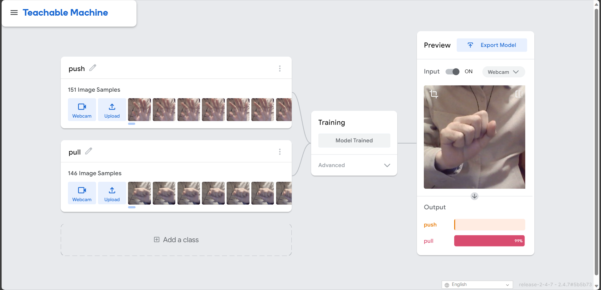

# Assignment 2

### Reading Response

The article was quite interesting.  
I enjoyed the comparison of today's machine learning algorithms to phrenology. We frequently attempt to infer character from what we observe, yet it's common for our assumptions to be incorrect. Regardless of how experienced we believe we are or how much we think we know about a subject, we can easily miss the essence. In the case of image classification training datasets, abstract characteristics can easily be misinterpreted or mislabeled. We often make numerous assumptions and incorporate our biases.

As we compile larger datasets, they demand more labor. Since labor can be expensive, we turn to cost-effective solutions like Amazon Mechanical Turk. The principle of investment and return is somewhat relevant here, leading to the potential for low effort results. To enhance the quality of the results, we might ask multiple participants to label the same image. However, we usually limit this to a small number (such as 3) to make a balance between quality and quantity.

While algorithms trained on such datasets might seem to work well in most scenarios, we can't guarantee the dataset's quality or fully understand the algorithm's inner workings. Therefore, we can't be certain that the model is without biases or errors. [Every reported incidents of false arrests based on facial recognition targeting black individuals](https://www.businessinsider.com/in-every-reported-false-arrests-based-on-facial-recognition-that-person-has-been-black-2023-8), [COMPAS perpetuating systemic injustice](https://www.propublica.org/article/machine-bias-risk-assessments-in-criminal-sentencing), [Amazon's biased hiring algorithm](https://www.reuters.com/article/us-amazon-com-jobs-automation-insight/amazon-scraps-secret-ai-recruiting-tool-that-showed-bias-against-women-idUSKCN1MK08G), and numerous other examples indicate that we often give too much trust in algorithms and their training databases without proper verifications.

### Transfer Learning

#### Training

#### Working Video

Visit working video page.

