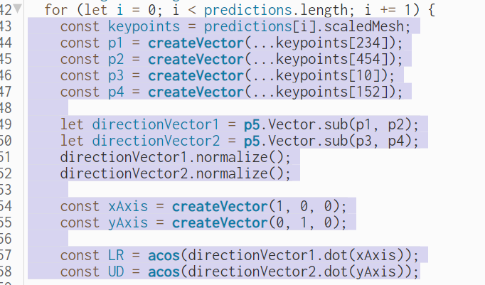
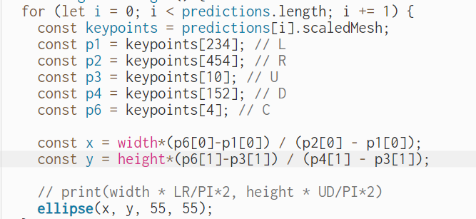
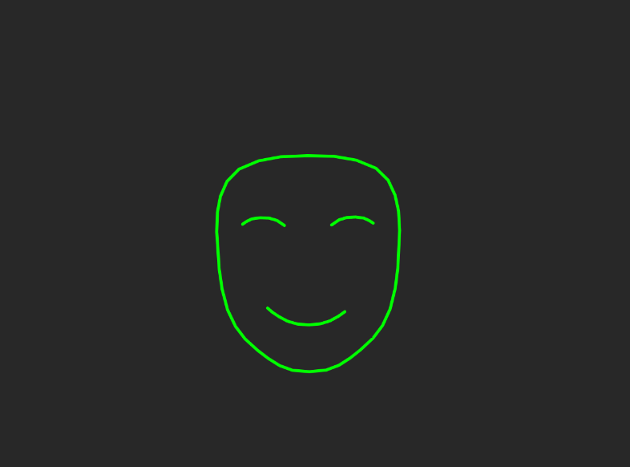

# Assignment 3

### Working with Models

This time, I decided to work with face mesh. I wanted to create something akin to a sunflower with the user's face representing the sun. So, I attempted to write something like this:  

However, I soon realized that my code was a bit clunky, and there was a simpler way to achieve a similar outcome. I quickly lost interest and moved on.

Next, I attempted to create the Atari Breakout game. The control part looked like this:

But I found the idea to be too simple, yet tedious to implement. Creating a decent game with good details requires a lot of time, so I set the code aside for later use ([code](https://editor.p5js.org/ob2sd/sketches/5YlGqCgd_)).

Then, I decided to write code for changing masks. Using features such as frameRate() and prediction.annotations, I created [this](https://editor.p5js.org/ob2sd/sketches/PcXJMV0z1) sketch. If you quickly shake your head left and right, the mask will change to either a smile or a frown depending on the direction of the movement.

