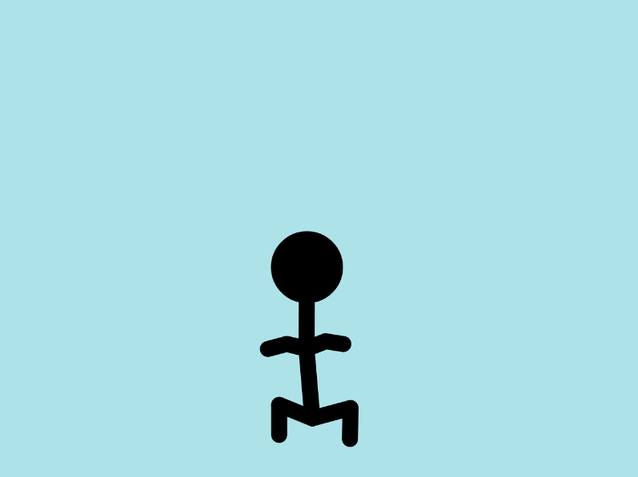
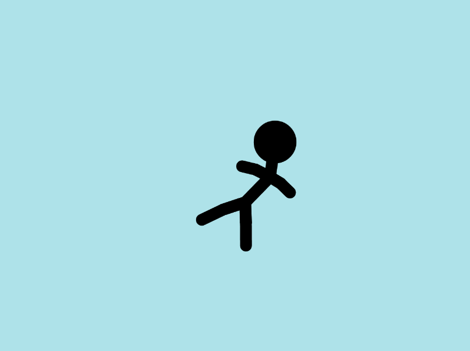

# Assignment 5

### Working with Models

This time, I had two ideas in my mind:

1. A virtual frosty window that would allow users to draw anything using a fingertip (or any other part of the hand that touches the wall). This idea required a highly sensitive z-position detection, but unfortunately, the ml5 model failed to support it. I considered using hand landmarks to measure the z-position, but hands are highly flexible in terms of rotation, which posed a significant challenge in consistency of the measurements. Eventually, I had to drop this idea.

2. My second idea was a finger-controlled puppet, similar to a string-controlled marionette. Initially, the image in my head looked promising, but I soon realized that implementing physics would be a painful task. To address this, I explored p5js examples and discovered [this one](https://p5js.org/examples/simulate-chain.html). I began experimenting with the example.

While the p5js example I found had a similar impression to what I had imagined, it was not an exact match for my requirements. Therefore, I had to explore different control mechanisms, adjust gravity directions, fine-tune damping and stiffness, and determine which body parts to control.

The above is approximately 70% complete. With a bit more adjustment, the result looks more natural(?).

You can find the code [here](https://editor.p5js.org/ob2sd/sketches/GoGZL0eJh).
