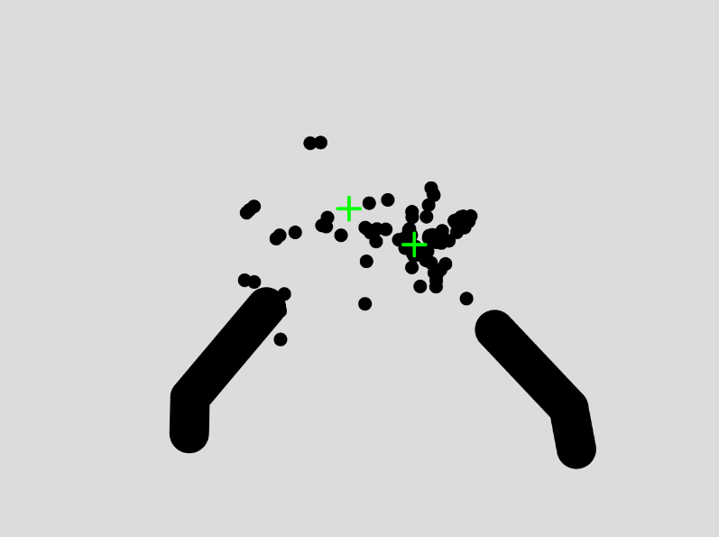
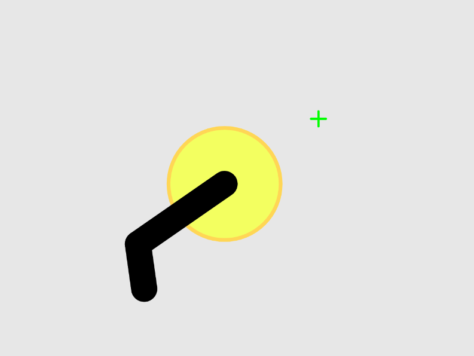

# Assignment 6

### Working with Models
It is unfortunate that I didn't bring my Arduino kit to school this semester. There would have been plenty of opportunities to explore different physical devices interacting with the ml5 library. I recalled that this week's assignment could be completed without using Arduino, so I opted for it.

This time, I wanted to create a finger gun. Since I still get confused about which index to use for each point, I created [this sketch](https://editor.p5js.org/ob2sd/sketches/5p8xYhpXw) for quick reference. Based on the identified points, I wanted to measure where the finger is pointing. So, I drew lines between the points of fingertips, knuckles, etc. and estimated where the finger is pointing. However, the ratio of the resulting image was not that great, so I defined a getNewPoint() function to obtain ratio-modifiable points. Then, I drew a gun (per hand).

Also, one of the bugging issues with the detected points is their lack of stability. So, I created an array of intermediary points that is populated via the updatePos() function for each new resulting point. The results became much smoother(and slow - sadly), although the detection may still be a bit shaky under some circumstances.

Additionally, to provide more context, I added FPS-like crosshairs, flashes, and bullet marks.
There are currently some things that I want to work on:
1. Move all related functions to a class-like structure to make the code more organized.
2. Fix the current gun trigger function, as it often malfunctions.
3. It would be nice to have recoil-like feedbacks on the screen.

After submitting the documentation, I will continue working on the project.

Below are the related images.  

The code is [here](https://editor.p5js.org/ob2sd/sketches/zRwrnbjKK).
