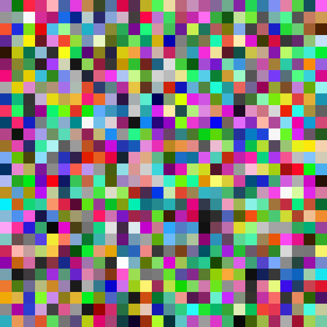

# Assignment 9

### Code Practice

My original plan was to train a model using the [Muffin vs. Chihuahua](https://www.kaggle.com/datasets/samuelcortinhas/muffin-vs-chihuahua-image-classification) dataset, but I soon realized that preparing for the training would be difficult. The dataset, composed of Google search results for chihuahuas and muffins, varied significantly in dimensions, image type, and so on. Expecting too many challenges within the scope of this class, I decided to switch to using DoodleNet instead.

I have not seen many examples of the DoodleNet classifier in use, other than in "Quick! Draw" and similar projects. So, I wanted to create something a bit different from the examples I had seen. Additionally, I was curious to test whether generating a targeted image is possible with a classifier model, similar to GAN models. To do so, I divided the canvas into 28x28 tiles, programmed it to sequentially update to a random color (the model apparently averages RGB values before evaluating), and then checked whether this made the canvas resemble a "cat" more closely, deciding whether to revert or keep each change based on the increase in likeness.

One interesting observation is that starting with a blank (all-white) canvas takes longer than beginning with a canvas randomly filled with colored tiles.

### Result

99% Cat. You may need the last one percent of imagination.
