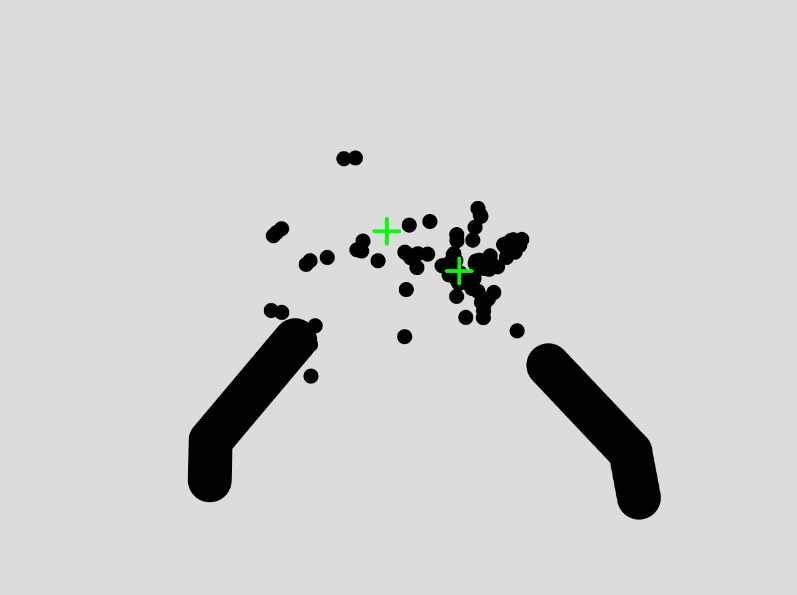
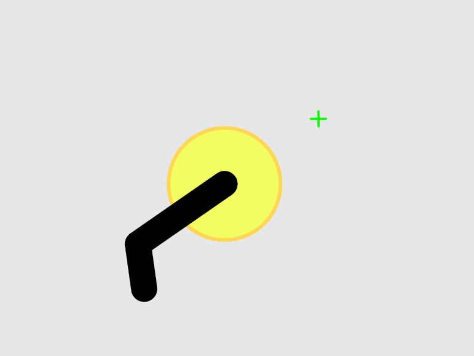

### Project Title

HandGun AR

### Sketch/Source Code Link

[https://editor.p5js.org/ob2sd/sketches/s1JpGtH4N](https://editor.p5js.org/ob2sd/sketches/s1JpGtH4N)

### One Sentence Description

Using their bare hands, users can experience shooting with virtually drawn pistols.

### Project Summary

My project, "HandGun AR," aims to integrate the physical and digital realms, enabling users to interact with a virtual environment using their fingers as simulated pistols. This idea originated from a previous assignment, where the unexpectedly positive outcome inspired me to refine and expand the concept. The project is developed with the next-gen ml5.js and primarily focuses on hand gesture interaction.

The core of the project involves recognizing and interpreting hand gestures to simulate the action of shooting in a virtual setting. I used the next-gen ml5.js HandPose model to track hand movements and gestures. The interaction includes elements such as aiming and shooting at a given target, mimicking the mechanics of a classic first-person shooter game.

Enhancements over the initial version include more structured and optimized code, glitch fixes, sound effects, and game-like elements such as targets and scoring systems. The project provides not only an entertaining and immersive experience but also explores the capabilities of gesture-based control in gaming and AR environments.

### Inspiration

My inspiration came from a previous assignment. The project turned out better than expected, leaving room for potential improvements. This sparked my interest in exploring augmented reality and interactive gaming, leading to the conception of this shooting game.

### Process

Since this project was built upon the previous project, the documentation starts there.

  
  

Many aspects needed addressing to create a smoother, AR-like experience. Below is the list:
1. Fix recognition-based issues (trigger detection, flickering, and aiming accuracy)
2. Modify the code structure to implement additional features
3. Add recoil-like visual feedback
4. Add sound effects and a background image
5. Introduce game-like features

#### Fix Recognition-based Issues (Trigger Detection, Flickering, and Aiming Accuracy)

There were numerous recognition-based issues to address. For instance, the model does not always accurately recognize keypoint coordinates under certain conditions such as poor lighting, camera angles, and some hand poses. As a result, when users move their hands, they experience incorrect recognitions, flickering, sudden jumps, or a lack of subtle gesture controls. Below is an example of incorrect recognition, where a certain one-hand gesture causes the HandPose model to mistakenly recognize it as two hands simultaneously.

It is challenging to handle model-based issues without side effects. For example, in the previous project, a delay in hand position change was introduced by displaying smoothed positions between the previous and current hand position to address sudden jumps.

Similarly, I went through many trials and errors to address trigger detection and flickering in the "best-effort" manner.

After numerous trials and errors, I settled on a combination of the thumb's bentness and the distance between the thumb and index finger. However, this method sometimes errs because 1) finger keypoints are not always tracked well in the model and 2) all mathematical operations are done in 2D space (model-provided 3D coordinates are unreliable).

Dealing with flickering went smoother than expected. I simply determined stability based on the visibility state remaining unchanged for 120ms. If something appeared or disappeared and the new state persisted for 120ms, the new state was applied.

There are relatively fixable issues on one hand, but there are also seemingly unsolvable issues on the other. I wanted to address the accuracy of determining where the finger is pointing, but nothing seemed effective. I tried manually adjusting, having a calibration session on each run, and other methods, but none worked. I eventually dropped the correction idea, as it was consuming too much project time.

#### Modify Code Structure to Implement Additional Features

Rewriting almost everything from scratch, except for some core functions, facilitated the implementation of other features without having to dig through the code.

#### Add Recoil-like Visual Feedback

After trying several options, I chose the "shift back from the crosshair" method because 1) it appears more natural in the project-specific conceptual 3D space, and 2) the already-implemented position smoothing creates a smooth animation.

#### Add Sound Effects and Background Image

Finding appropriate assets is always difficult and time-consuming. Fortunately, I found suitable sound effects, but for the background image, I had to use a DALL-E generated one. It’s not perfect, but it suits the project.

#### Add Game-like Features

Unfortunately, I didn’t have enough time to implement many game-like features. For simplicity, I added a basic scoring system and a sketch reset mechanism that clears everything when idle for 5 seconds.

### Audience/Context

The project is designed for individuals interested in augmented reality and interactive gaming. Users can engage with the game using hand gestures, creating an immersive experience reminiscent of simple first-person shooters. The simplicity of the control mechanism makes it accessible to a wide audience, offering a novel and enjoyable way to interact with virtual environments.

### User Testing

Some testers pointed out that some gestures were not performing as intended. While I fixed some issues, others will have to wait for model updates.

### Final Product

