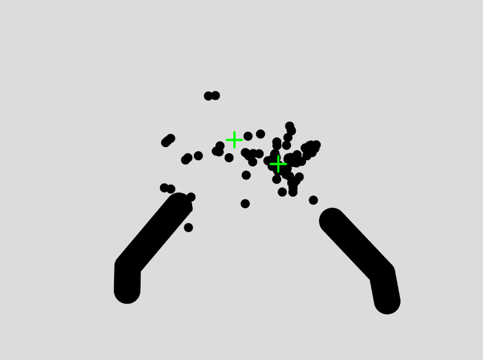
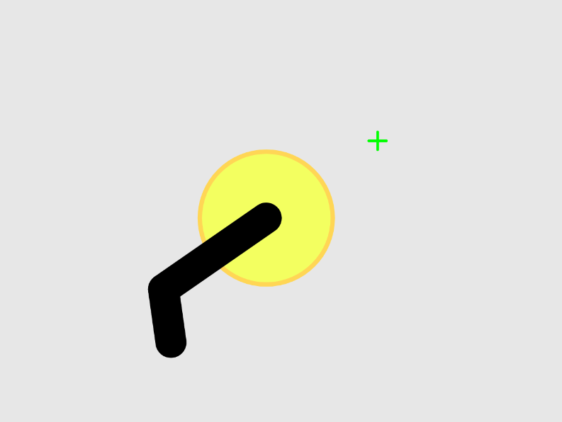

### Project Title

HandGun AR

### One Sentence Description

Using bare hands, users will be able to experience shooting with virtually drawn pistols.

### Project Abstract

My project, "HandGun AR," aims to integrate the physical and digital realms by enabling users to interact with a virtual environment using their fingers as simulated pistols. This idea originated from a previous assignment, where the unexpectedly positive outcome inspired me to refine and expand the concept. The game will be developed using technology similar to augmented reality, primarily focusing on hand gestures for interaction.

The core of the project will involve recognizing and interpreting hand gestures to simulate the action of shooting in a virtual setting. I plan to integrate the next-gen ml5.js HandPose model to accurately track hand movements and gestures. The interactions will include elements like aiming and shooting, and possibly other interactive gestures to mimic the mechanics of a classic first-person shooter game.

Enhancements over the initial version will include more structured and optimized code, fixing glitches, adding sound effects, and introducing game-like elements such as targets or scoring systems. The project will not only provide an entertaining and immersive experience but also explore the capabilities of gesture-based control in gaming and AR environments.

### Inspiration

My inspiration came from a previous assignment. The project turned out better than my expectations, while leaving room for potential improvements. This sparked my interest in exploring augmented reality and interactive gaming, leading to the conception of this shooting game.

### Visual Reference

### Audience

The project is designed for individuals interested in augmented reality and interactive gaming. Users will engage with the game using hand gestures, creating an immersive experience reminiscent of classic first-person shooters. The simplicity of the control mechanism makes it accessible to a wide audience, offering a novel and enjoyable way to interact with virtual environments.

### Challenges

The biggest technical challenge I expect is accurately tracking gestures in real-time and correctly linking them to virtual interactions. Ensuring the HandPose model seamlessly integrates with the game mechanics to provide a responsive and intuitive user experience will be crucial. Conceptually, balancing simplicity with engaging gameplay to appeal to a broad audience while maintaining the novelty of the AR experience presents a significant challenge.

### Code Sketches

The code for the previous assignment can be found [here](https://editor.p5js.org/ob2sd/sketches/zRwrnbjKK).

